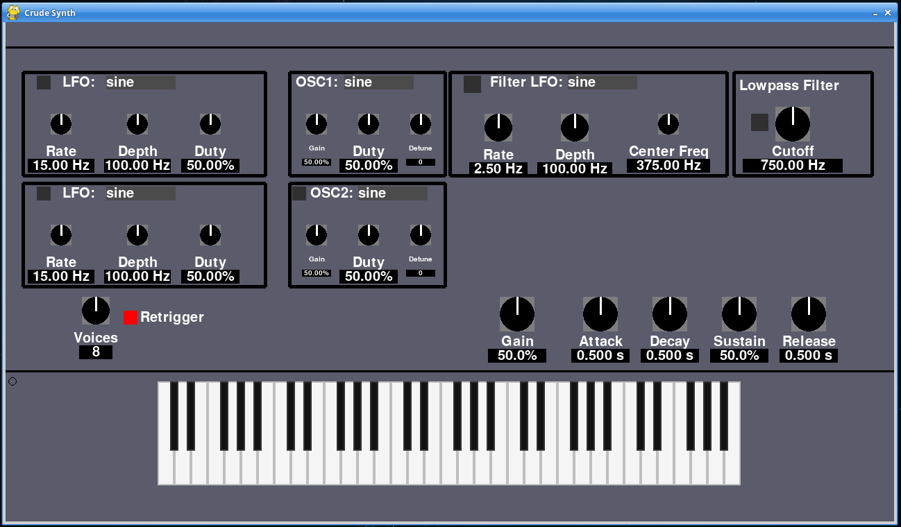

# Crude Synth
The crude synth is a python GUI synth app, playable with your keyboard!

This a prototype/proof of concept synth project using python. There are many examples of synths made with python so the general functionality was expected to work. The major question was when would python be to slow to handle the semi real-time processes. Surprisingly, with just 1 oscillator, 16 voices can easily be achieved, if the release setting is not too high. 

There are buffer underflows (data is not being feed to the audio stream fast enough) when all the LFOs, both oscillators and filter is active. This can be controlled with the number of Voices knob, by setting the voices to re-trigger, reducing the release time, or turning off one or more LFOs/Oscillators.




This app is released as is, and is not really intended to be a serious synth application. However, one can make some cool noise with the app. 

The code is currently a mess, as the project was more or less hacked together and future development is likely to be limited or non-existent.

### Features
- 2 oscillators with selectable waveform, detuning, and gain
- LFO for each oscillator
- Low-pass filter, which can be set to modulator around a center frequency
- ADSR Envelope settings
- Adjustable voice count and re-trigger setting


### Waveforms availble
- Sine
- Sawtooth
- Trianlge
- Pulse, with adjustable duty cycle length
- Noise

### Running the app
All the code and assets needed are contained in the `crudesytnh' directory.

Dependencies: 
- python >= 3.8
- pygame >= 2.1
- numpy >= 1.15
- sounddevice >= 0.4.6


Once the dependable are met, simply run `app.py` from within the `crudesynth` directory.

### Controls
All controls are mouse clickalbe. To play the synth use your computer keyboard: a,w,s,e,d,f,t,g,y,h,u,j 

These map to the piano keys as follows:
```
    |  |w| |e|  |  |t| |y| |u|  |
    |a |_|s|_|d |f |_|g|_|h|_|j |
    |___|___|___|___|___|___|___|
```

Only one octave is playable at a time, but the octave can be switched using the up and down arrows on your keyboard. There is one notable bug, I mean feature, where if a key is held down and the octave switched, the key will remain down and sustaining. This may actuall provide a way to make some crazy sounds!


Enjoy!!
